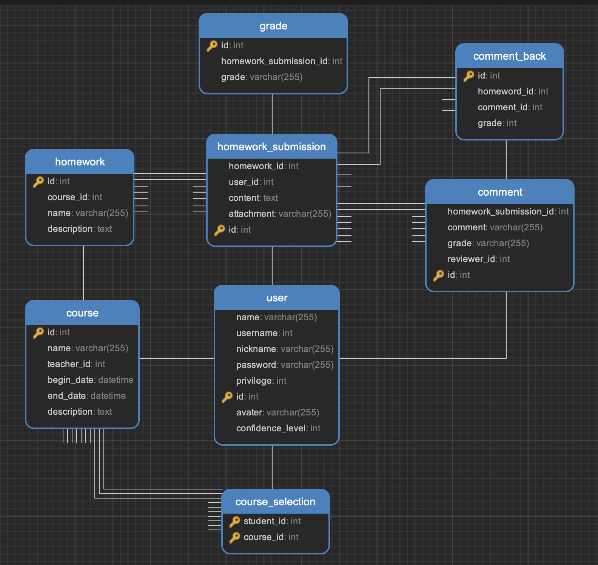

# HomeworkPlatform

## 构建

本项目使用 [goreleaser/goreleaser: Deliver Go binaries as fast and easily as possible](https://github.com/goreleaser/goreleaser) 来辅助构建。

### 1. 安装 goreleaser

MacOS - Homebrew：

```shell
brew install goreleaser/tap/goreleaser
brew install goreleaser
```

Windows - Scoop：

```shell
scoop bucket add goreleaser https://github.com/goreleaser/scoop-bucket.git
scoop install goreleaser
```

Universal - Go Install：

```shell
go install github.com/goreleaser/goreleaser@latest
```

### 2. 克隆代码

```shell
git clone --recurse-submodules https://github.com/cloudreve/Cloudreve.git
```

### 3. 编译项目

```shell
goreleaser build --clean --single-target --snapshot
```

## 数据库设计



test feat(test): feat commit
test fix(test): fix commit
test chore(test): chore commit
test test(test): test commit