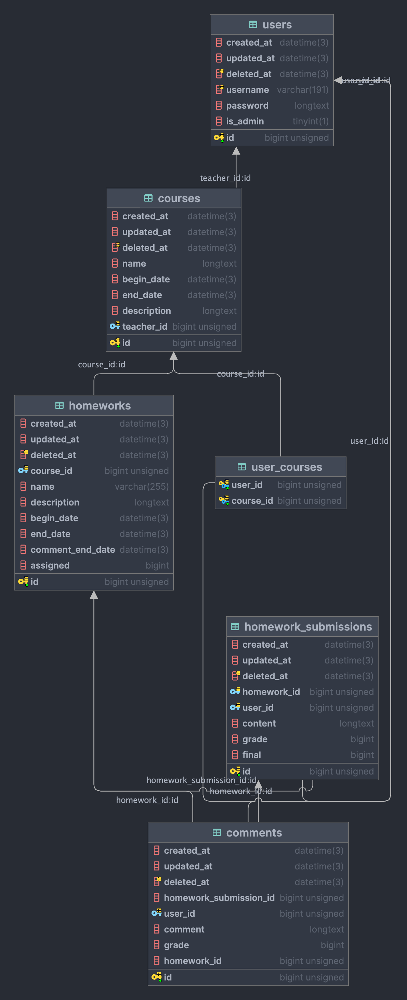

# HomeworkPlatform

## 开发

`assets/` 目录下是前端仓库的子模块。

如果要用前端的开发服务器的话，就先到 `assets/` 里 `pnpm dev`，再出来 `go run . --dev`，

`--dev` 会让前端的中间件把所有前端的请求通过反向代理转到 `localhost:3000`（也就是 pnpm dev 的监听地址）

或者先进行 `pnpm build`，再 `go run .`，不过这样前端就是使用的固定的构建结果的文件。

## 构建

本项目使用 [goreleaser/goreleaser: Deliver Go binaries as fast and easily as possible](https://github.com/goreleaser/goreleaser) 来辅助构建。

### 1. 安装 goreleaser

MacOS - Homebrew：

```shell
brew install goreleaser/tap/goreleaser
brew install goreleaser
```

Windows - Scoop：

```shell
scoop bucket add goreleaser https://github.com/goreleaser/scoop-bucket.git
scoop install goreleaser
```

Universal - Go Install：

```shell
go install github.com/goreleaser/goreleaser@latest
```

### 2. 克隆代码

```shell
git clone --recurse-submodules https://github.com/cloudreve/Cloudreve.git
```

### 3. 编译项目

```shell
goreleaser build --clean --single-target --snapshot
```

## 数据库设计

